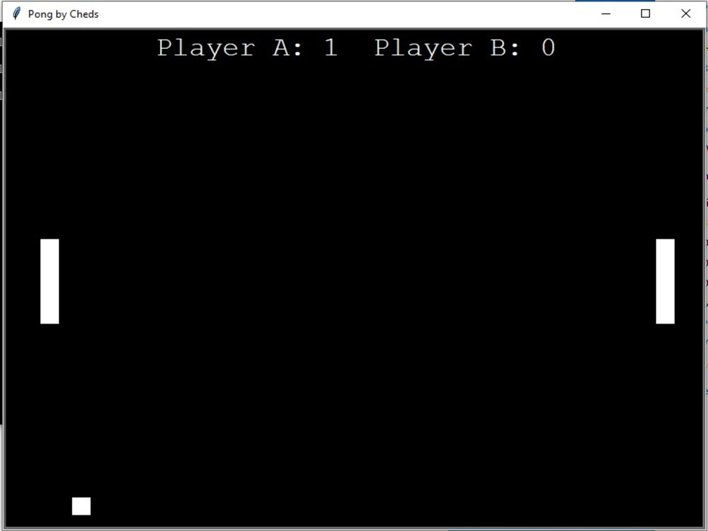

# Python Pong&middot;  

## Description 
This is a recreation of the classic game of pong, i wrote this as a hobby while working away in November 2019, because of this project i enrolled in a bootcamp to get serious about coding. It is a two player application W,S for player one, up-arrow, down-arrow for player 2

## Table of Contents 
* [Installation](#Installation)
* [Usage](#Usage)
* [License](#License)
* [Contributions](#Contributions)
* [Tests and Examples](#Tests)
* [Questions](#Questions)

## Installation  

Currently have not got around to looking for Python deployment site so just copy and paste the source code into your own Python Environment

## Usage  
This is a very simple game intended to be fun

## License  
Academic Free License v3.0

[Click Here to go to License Site!](https://opensource.org/licenses/AFL-3.0)

## Tests and Examples  
Try bounce the pong ball past your opposing player to score

## Questions  
If there are any questions feel free to reach me at [Github](https://github.com/ChrisAMK)

or E-mail me at chriskl@live.com

